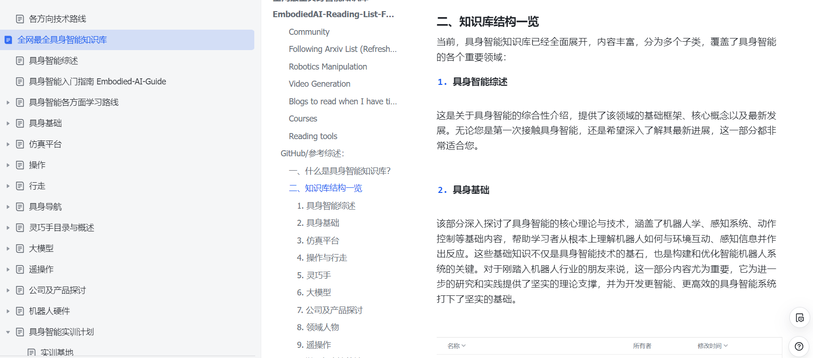

# 📘 具身智能基础教育知识库

> 注：该知识库文档内容版权为各章节内容贡献者所有，未经允许有盗用、搬运、商用行为，通过大数据稽查发现违者必究！

> 暂时无法在飞书文档外展示此内容  
> 加交流群可扫木木-具身，日常文档更新会在“具身知识库”公众号发布

---

## 📚 相关链接与资源索引

- [EmbodiedAI-Reading-List-For-Lists](https://github.com/StarCycle/EmbodiedAI-Reading-List-For-Lists)
- [具身智能中文指南](https://github.com/TianxingChen/Embodied-AI-Guide)
- [具身智能创业项目信息汇总](https://github.com/FreesiaGPT/Embodied-AI)
- [HCPLab Paper List](https://github.com/HCPLab-SYSU/Embodied_AI_Paper_List)
- [行业综述文章](https://mp.weixin.qq.com/s/SH_ArBo7SOVkGaqYZNuHZQ)

---

## 📖 一、什么是具身智能知识库？

具身智能知识库是一个开放平台，整合当前具身智能领域的前沿技术、理论与应用案例。平台面向初学者与专家，提供课程文档、技术笔记、研究总结、社群讨论等资源。

知识库已运行超一年，吸引近 100 位专家加入，数据来源包括 PPT 总结、论文资料、技术分享、社群讨论等。

- 飞书 Wiki 页面：[飞书链接](https://yv6uc1awtjc.feishu.cn/wiki/WPTzw9ON0ivIVrkLjVocNZh8nLf?from=from_copylink)

---

## 🧱 二、知识库结构一览

### 1. 具身智能综述

综合介绍具身智能的基础框架、核心概念与发展趋势。

### 2. 具身基础

涵盖机器人感知、动作控制与交互的基本理论，适合新入门者。

### 3. 仿真平台

包括常见模拟器工具，如 Mujoco、Isaac Gym、RoboSuite、Genesis 等。

### 4. 操作与行走

描述机器人抓取、搬运与行走等复杂动作执行策略。

### 5. 灵巧手

涵盖仿人手的设计与控制方法。

### 6. 大模型

介绍如 OCTO、OPENVLA、RDT 等大模型算法在具身任务中的应用。

### 7. 公司与产品

列举国内外代表性具身智能公司与技术路径。

### 8. 领域人物

从“人物故事”视角观察生态发展、团队路线与技术价值观。

### 9. 遥操作

讲解远程操控的技术实现与应用场景。

---

## 👥 三、社区与规则

- 各模块微信群交流答疑
- 对个人用户开放免费浏览，下载需贡献内容
- 企业支持订阅制，包含问答服务
- 专家定期更新内容，收益用于知识库建设

---

## 🌐 四、访问入口

- 飞书 Wiki 页面：[飞书链接](https://yv6uc1awtjc.feishu.cn/wiki/WPTzw9ON0ivIVrkLjVocNZh8nLf?from=from_copylink)
- 加入群聊请联系“木木-具身”获取二维码

---

> 📌 更多内容请关注“具身知识库”公众号，持续更新中。

