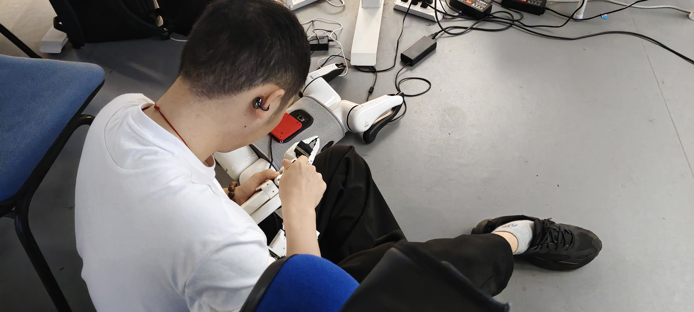

# 🧠 实验室重点项目展示页

欢迎访问我们实验室的项目主页！我们专注于**具身智能系统研究与教育实训平台开发**，目前有以下几个重点项目：

  <a href="embodied-education.md">具身教育</a>
  <a href="practical-courses.md">实训课程</a>
  <a href="manipulator.md">机械臂</a>
  <a href="quadruped.md">四足机器人</a>
  <a href="dexterous-hand.md">灵巧手</a>

---

## 🎥 展示视频（Bilibili）

<iframe src="https://player.bilibili.com/player.html?bvid=BV1xM4y1Z7Xn&autoplay=0" scrolling="no" frameborder="no" allowfullscreen="true" width="100%" height="450"></iframe>

---

## 📸 实验图集

---

> 本页面基于 GitHub Pages 构建，使用 Jekyll + Markdown，支持持续更新维护。
