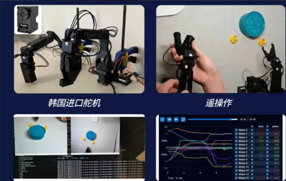
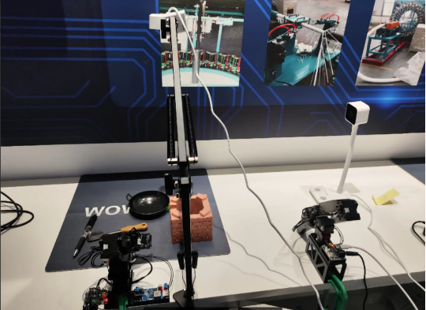

# 🤖 XBot 机械臂实训项目

## 🌟 实训课程初衷

在过去两个月的具身智能实训普及过程中，我们发现：
- 课程完成后，硬件容易被闲置，造成浪费
- 录制视频课程难以讲清复杂操作

因此我们决定推出线上直播形式的实训课程：  
- 💡 由我们将硬件邮寄给学员  
- 📡 腾讯会议授课，结合直播 + 答疑 + 任务驱动式教学

---

## 📸 学员成果展示

- 【XBot实验室具身分享 - ACT纯视觉抓取】  
  [点击观看哔哩哔哩视频](https://www.bilibili.com/video/BV1xM4y1Z7Xn)
- 公众号文章：  
  [学员展示报告](https://mp.weixin.qq.com/s/jhEl7Ft91eWV4Sghsz8XtQ)

---
## 📸 实验图集

---
## 📅 实训时间安排（2025.2.22 – 3.22）

- 每周形式：在线授课 + 直播答疑 + 文档答疑
- 教学平台：腾讯会议 + 飞书知识库 + GitHub 代码仓库

部分课程安排：

| 内容 | 主讲 |
|------|------|
| 即插即用硬盘系统教学 | @天好凉 |
| 机器人上手与数据采集 | @淬子 |
| ACT 算法训练 | @wwq |
| deepseek语音交互试验 | @淬子 |
| diffusion算法实验 | @天好凉 |
| Pi0算法讲解与复现 | @林博 |
| 毕业仪式 | 全体团队 |

---

## 🏛️ XBot 实训基地愿景与使命

> “让技术不止于想象，让智能触手可及。”

### 🎯 愿景
- 构建开放、共享、创新的具身智能实训社区
- 培养千名机器人研究与工程人才

### 🌱 核心使命
- **开放共享**：人人可学，资源开放
- **实战导向**：项目实操驱动技能提升
- **社区共建**：成员共创、共管、共享
- **人才成长**：项目中培养科研/工程能力

---

## 🔧 核心价值观

- **开放包容**：欢迎跨学科背景成员
- **实战优先**：以真实项目驱动学习
- **协作共赢**：推动集体成长与合作
- **持续创新**：保持对前沿技术的探索

---

## 📈 发展规划

### 1. 开放实验平台
- 提供标准机器人硬件与环境  
- 支持感知、控制、学习算法训练

### 2. 多元实训项目
- 融合人机交互、路径规划、强化学习等方向
- 结合真实行业场景进行应用开发

### 3. 技术交流社区
- 每月沙龙 / Hackathon / 讲座  
- 支持线上开源分享与线下合作

### 4. 创新孵化支持
- 提供资源 + 导师 + 项目评估 + 创业孵化通道

---

## 💰 盈利模式（用于持续运营）

- 实训课程、企业定制课
- 项目技术服务合作
- 设备与场地租赁支持
- 优秀项目成果转化与孵化

---

## 🚀 未来展望

XBot将建设成为多层次、全方位的具身智能教育与创新基地，连接学生、研究人员、企业家与开发者，共同探索、共同进化。

